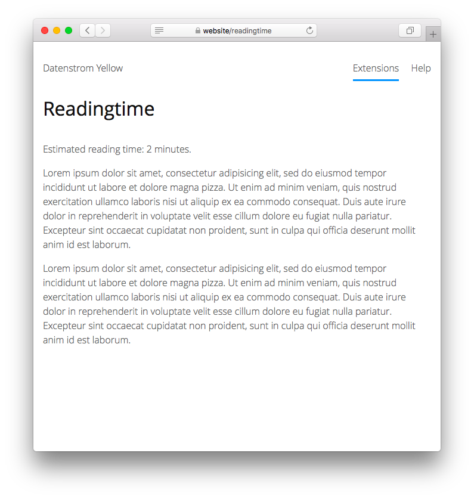

<p align="right"><a href="README-de.md">Deutsch</a> &nbsp; <a href="README.md">English</a></p>

# Readingtime 0.8.22

Zeigt die geschätzte Lesezeit für den Seiteninhalt an.

<p align="center"></p>

## Wie man eine Erweiterung installiert

[ZIP-Datei herunterladen](https://github.com/schulle4u/yellow-readingtime/archive/refs/heads/main.zip) und in dein `system/extensions`-Verzeichnis kopieren. [Weitere Informationen zu Erweiterungen](https://github.com/annaesvensson/yellow-update/tree/main/README-de.md).

## Wie man die geschätzte Lesezeit anzeigt

Erstelle eine `[readingtime]`-Abkürzung. Das folgende optionale Argument ist verfügbar: 

`WordsPerMinute` = Die Anzahl Wörter pro Minute, die zur Berechnung der Lesezeit verwendet wird  

Mit dieser Inline-Abkürzung kann den Besuchern deiner Webseite eine ungefähre Lesezeit angezeigt werden, was für längere Blog- und Wiki-Artikel eine nette Zusatzinformation ist. Je nach Inhalt und lesegeschwindigkeit wird dieser Wert jedoch abweichen, daher kannst du ihn für dein Publikum entsprechend anpassen. 

## Beispiele

Allgemeine Verwendung: 

    Geschätzte Lesezeit: [readingtime] Minuten.

Berechne die Lesezeit mit 400 Wörtern pro Minute:

    Geschätzte lesezeit: [readingtime 400] Minuten.

Blogseiten-Layout um die ungefähre Lesezeit automatisch anzuzeigen:

```
<?php $this->yellow->layout("header") ?>
<div class="content">
<div class="main" role="main">
<?php $this->yellow->page->set("entryClass", "entry") ?>
<?php if ($this->yellow->page->isExisting("tag")): ?>
<?php foreach (preg_split("/\s*,\s*/", $this->yellow->page->get("tag")) as $tag) { $this->yellow->page->set("entryClass", $this->yellow->page->get("entryClass")." tag-".$this->yellow->lookup->normaliseArguments($tag, false)); } ?>
<?php endif ?>
<div class="<?php echo $this->yellow->page->getHtml("entryClass") ?>">
<div class="entry-title"><h1><?php echo $this->yellow->page->getHtml("titleContent") ?></h1></div>
<div class="entry-meta"><p><?php echo $this->yellow->page->getDateHtml("published") ?> <?php echo $this->yellow->language->getTextHtml("blogBy") ?> <?php $authorCounter = 0; foreach (preg_split("/\s*,\s*/", $this->yellow->page->get("author")) as $author) { if (++$authorCounter>1) echo ", "; echo "<a href=\"".$this->yellow->page->getPage("blogStart")->getLocation(true).$this->yellow->lookup->normaliseArguments("author:$author")."\">".htmlspecialchars($author)."</a>"; } ?> | <?php echo $page->parseContentShortcut("readingtime", "", "inline"); ?> Minuten</p></div>
<div class="entry-content"><?php echo $this->yellow->page->getContentHtml() ?></div>
<?php echo $this->yellow->page->getExtraHtml("profile") ?>
<?php echo $this->yellow->page->getExtraHtml("link") ?>
<?php if ($this->yellow->page->isExisting("tag")): ?>
<div class="entry-tags">
<p><?php echo $this->yellow->language->getTextHtml("blogTag") ?> <?php $tagCounter = 0; foreach (preg_split("/\s*,\s*/", $this->yellow->page->get("tag")) as $tag) { if (++$tagCounter>1) echo ", "; echo "<a href=\"".$this->yellow->page->getPage("blogStart")->getLocation(true).$this->yellow->lookup->normaliseArguments("tag:$tag")."\">".htmlspecialchars($tag)."</a>"; } ?></p>
</div>
<?php endif ?>
<?php echo $this->yellow->page->getExtraHtml("comment") ?>
</div>
</div>
</div>
<?php $this->yellow->layout("footer") ?>
```

## Einstellungen

Die folgende Einstellung kann in der Datei `system/extensions/yellow-system.ini` vorgenommen werden:

`ReadingtimeWordsPerMinute` = Die Anzahl Wörter pro Minute, die zur Berechnung der Lesezeit verwendet wird  

## Danksagung

Vielen Dank an die Datenstrom-Yellow-Gemeinschaft für Hilfe und Feedback!

## Entwickler

Steffen Schultz. [Hilfe finden](https://datenstrom.se/de/yellow/help/).
