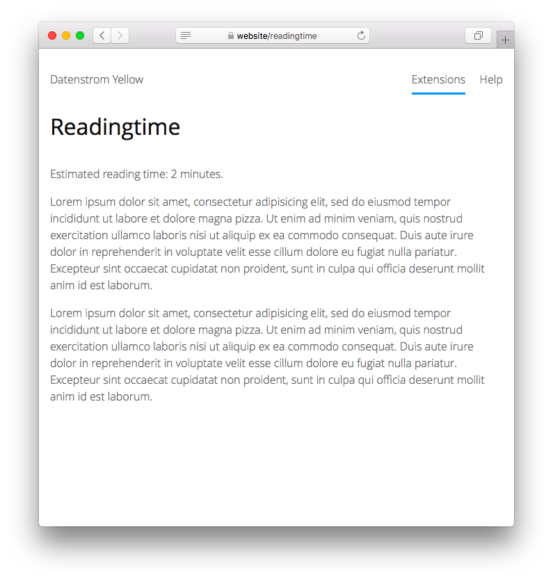

<p align="right"><a href="README-de.md">Deutsch</a> &nbsp; <a href="README.md">English</a></p>

# Readingtime 0.8.22

Show estimated reading time for page content.

<p align="center"></p>

## How to install an extension

[Download ZIP file](https://github.com/schulle4u/yellow-readingtime/archive/refs/heads/main.zip) and copy it into your `system/extensions` folder. [Learn more about extensions](https://github.com/annaesvensson/yellow-update).

## How to show estimated reading time

Create a `[readingtime]` shortcut. The following optional argument is available: 

`WordsPerMinute` = number of words per minute to calculate the estimated reading time  

This is a basic inline shortcut to show an estimated reading time for your pages, useful in blog and wiki articles to give your visitors an idea how long it may take to read a text. The actual reading time will vary depending on content and reading speed, therefore you can modify the words per minute calculation to suit your audience. 

## Examples

Basic usage: 

    Estimated reading time: [readingtime] minutes.

Calculate reading time with 400 words per minute:

    Estimated reading time: [readingtime 400] minutes.

Blog page layout to automatically show an estimated reading time:

```
<?php $this->yellow->layout("header") ?>
<div class="content">
<div class="main" role="main">
<?php $this->yellow->page->set("entryClass", "entry") ?>
<?php if ($this->yellow->page->isExisting("tag")): ?>
<?php foreach (preg_split("/\s*,\s*/", $this->yellow->page->get("tag")) as $tag) { $this->yellow->page->set("entryClass", $this->yellow->page->get("entryClass")." tag-".$this->yellow->lookup->normaliseArguments($tag, false)); } ?>
<?php endif ?>
<div class="<?php echo $this->yellow->page->getHtml("entryClass") ?>">
<div class="entry-title"><h1><?php echo $this->yellow->page->getHtml("titleContent") ?></h1></div>
<div class="entry-meta"><p><?php echo $this->yellow->page->getDateHtml("published") ?> <?php echo $this->yellow->language->getTextHtml("blogBy") ?> <?php $authorCounter = 0; foreach (preg_split("/\s*,\s*/", $this->yellow->page->get("author")) as $author) { if (++$authorCounter>1) echo ", "; echo "<a href=\"".$this->yellow->page->getPage("blogStart")->getLocation(true).$this->yellow->lookup->normaliseArguments("author:$author")."\">".htmlspecialchars($author)."</a>"; } ?> | <?php echo $this->yellow->page->parseContentShortcut("readingtime", "", "inline"); ?> minutes</p></div>
<div class="entry-content"><?php echo $this->yellow->page->getContentHtml() ?></div>
<?php echo $this->yellow->page->getExtraHtml("profile") ?>
<?php echo $this->yellow->page->getExtraHtml("link") ?>
<?php if ($this->yellow->page->isExisting("tag")): ?>
<div class="entry-tags">
<p><?php echo $this->yellow->language->getTextHtml("blogTag") ?> <?php $tagCounter = 0; foreach (preg_split("/\s*,\s*/", $this->yellow->page->get("tag")) as $tag) { if (++$tagCounter>1) echo ", "; echo "<a href=\"".$this->yellow->page->getPage("blogStart")->getLocation(true).$this->yellow->lookup->normaliseArguments("tag:$tag")."\">".htmlspecialchars($tag)."</a>"; } ?></p>
</div>
<?php endif ?>
<?php echo $this->yellow->page->getExtraHtml("comment") ?>
</div>
</div>
</div>
<?php $this->yellow->layout("footer") ?>
```

## Settings

The following setting can be configured in file `system/extensions/yellow-system.ini`:

`ReadingtimeWordsPerMinute` = number of words per minute to calculate the estimated reading time  

## Acknowledgements

Thanks to the Datenstrom Yellow community for help and feedback!

## Developer

Steffen Schultz. [Get help](https://datenstrom.se/yellow/help/).
